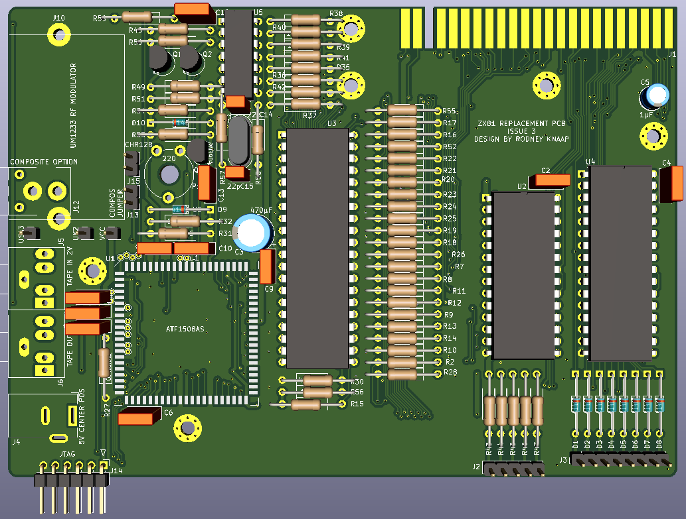
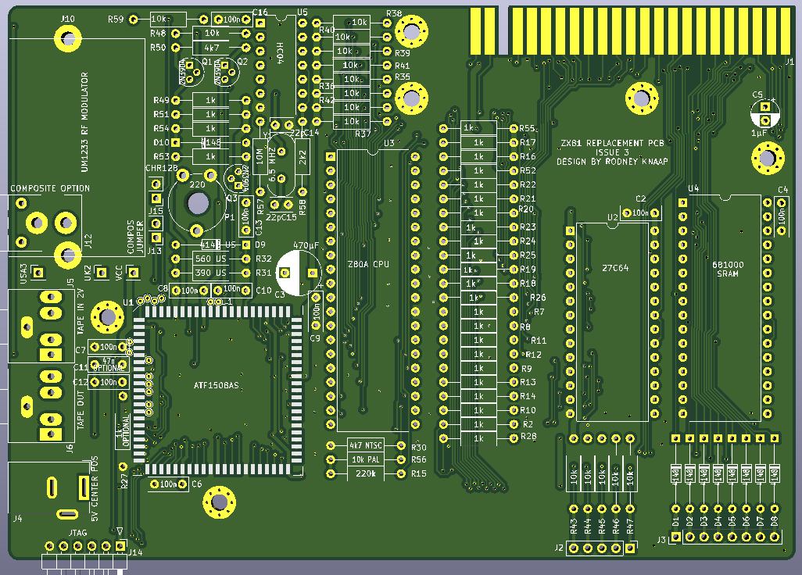
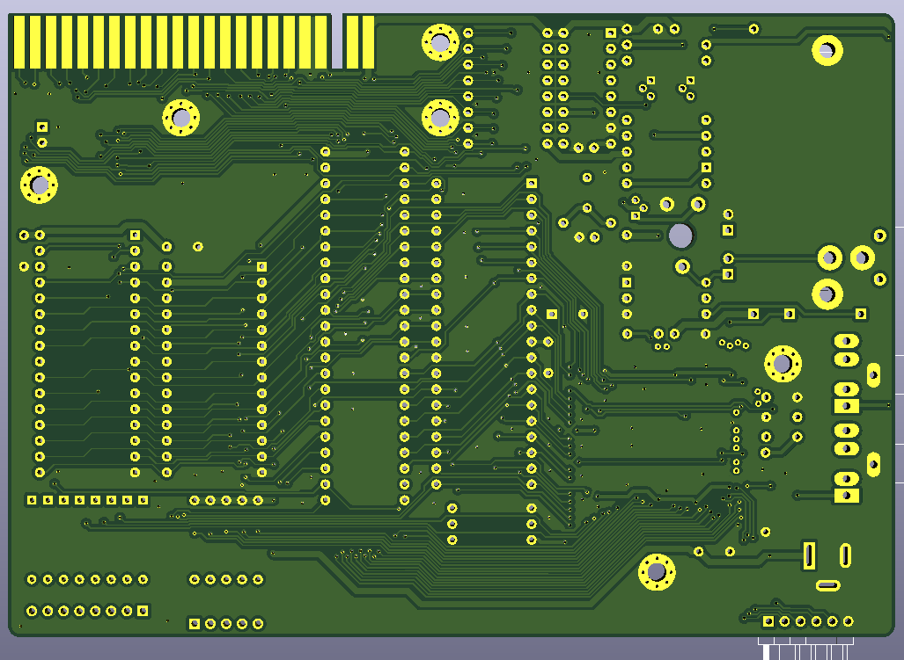

# ZX81_ISSUE_3
ZX81 Computer Replacement concept and PCB design in the same style as the Sinclair ZX81 ISSUE 3 however using a CPLD to replace the original ULA, for example if your ULA is defective.

  

## Purpose and permitted use, cautions for a potential builder of this design
This project was created for historical purposes out of love for historical computing designs and for the purpose of enabling computing enthousiasts with a sufficient level of building and troubleshooting expertise to be able to experience the technology by building and troubleshooting the hardware described in this project.

Besides the GPL3 license there are a few warnings and usage restrictions applicable:
No guarantees of function or fitness for any particular or useful purpose is given, building and using this design is at the sole responsibility of the builder.

Do not attempt this project unless you have the necessary electronics assembly expertise and experience, and know how to observe all electronics safety guidelines which are applicable.

It is not permitted to use the computer built from this design without the assumption of the possibility of loss of data or malfunction of the connected device. To be used strictly for personal hobby and experimental purposes only. No applications are permitted where failure of the device could result in damage or injury of any kind.

If you plan to use this design or any part of it in new designs, the acknowledgement of the designer and the design sources and inspirations, historical and modern, of all subparts contained within this design should be included and respected in your publication, to accredit the hard work, time and effort dedicated by the people before you who contributed to make your project possible.

No guarantee for any proper operation or suitability for any possible use or purpose is given, using the resulting hardware from this design is purely educational and experimental and not intended for serious applications. Loss of data is likely and to be expected when connecting any storage device or storage media to the resulting system from this design, or when configuring or operating any storage device or media with the system of this design.

When connecting this system to a computer network which contains stored information on it, it is at the sole responsibility and risk of the person making the connection, no guarantee is given against data loss or data corruption, malfunctions or failure of the whole computer network and/or any information contained inside it on other devices and media which are connected to the same network.

When building this project, the builder assumes personal responsibility for troubleshooting it and using the necessary care and expertise to make it function properly as defined by the design. You can email me with questions, but I will reply only if I have time and if I find the question to be valid. Which will probably also lead to an update here. I want to primarily dedicate my time to new project development, I am not able to do any user support, so that's why I provide the elaborate info here which will be expanded if needed.

---------------------------------------------

# Acknowledgements

This project was inspired by:
- Sinclair computers in the 1980s
- Wilf Rigter who helped me with my PCB designs in the 1990s
- the German ZX-Team who inspired me a lot by sending me their Magazin and kind letters and messages. Particularly Peter Liebert Adelt and Kai Fischer with whom I have had very pleasant and memorable contact in the 1990s years.
- Gary Kildall who invented CP/M, the concept of splitting the BIOS from software operation and so much more
- Wayne Warthen who created and manages the ROMWBW CP/M project development which is part of the basis of this project

---------------------------------------------

# Outline of the project
This project has been created in order to repair a defective ZX81 where the original ULA has gone defective, or where the user wants to improve the existing computer with a more modern quality design and solution, where:
- we keep the original look and feel of the Issue 3 PCB by Sinclair
- we want to keep the UM1233 modulator in the computer in order to preserve certain nostalgic aspects and effects such as noise when tuning into the TV channel

Advantages of this design:  
- more modern CPLD is used instead of ULA
- manufacturing a new PCB provides a much better quality PCB and could be done with ENIG gold plating on expansion connector
- the computer is to a large degree reconfigurable by reprogramming the ULA
- we can use some form of bank switching to increase the RAM size to 128KB
- we can create a shadow copy mechanism to feature the ROM code in RAM and thus featuring the entire Z80 memory space in RAM
- we would be able to load new ROM code from a tape program, move it in a RAM segment and switch it in place of the ROM area
- CHR$128 UDG is supported
- transistor stages for reliable and convenient line level 2V tape loading using a phone or PC headphone output
- transistor amplifier with potmeter level adjustment for the video signal going into the modulator
- free CPLD pins available on solder pads for creating custom circuits using the CPLD for example a joystick, sound output etc
- the memory map is completely reprogrammable
- using the CPLD we can include register bits for enabling operating modes and switching options in software

The PCB is designed much in the same style of the Issue 3 ZX81 PCB. Which means it has all resistors in horizontal orientation, with the same lead length of resistors and diodes.  

The PCB contains the CPLD, Z80A CPU, 27C64 EPROM, 681000 SRAM and a 74HC04 for generating the clock signal.  

The JTAG pins are on the bottom PCB edge, so it will be easy to open the ZX81 case, plug in a programming cable and reprogram the CPLD without needing to unscrew the PCB from the top shell, which spares the membrane keyboard from being unplugged and plugged back in too many times.

There is no linear regulator on the PCB, instead a modern 5V DC power supply can be used resulting in less heat inside the ZX81 case.

Why this PCB? For people who like the look and style of the original Issue 3 PCB, however want to repair a faulty ULA but at the same time don't want to plug in or wire an adapter PCB, and rather would prefer a more tidy new single PCB design, and yet want to maintain the look and feel of an original Issue 3 PCB as much as possible and reasonable.

The 27C64 EPROM was chosen because the D2364 has a pinout somewhat different from a 27C64, which would make replacing the ROM more difficult.

The PCB contains a modulator footprint as well. Why a modulator? Because having a modulator, while this decreases the display quality a little, it also has some interesting quirks which some users may enjoy for nostalgic reasons. For example, when tuning into the channel on a TV tuner, it also produces a typical sound/noise in the TV speaker, somewhat corresponding to the pixel patterns seen on the screen. 

Having the modulator and tuning into the channel does provide a more true to original experience. A transistor video output stage and potmeter are included for adjusting output video voltage level, because this may benefit the modulation quality by being able to adjust the signal ideally for the input of the modulator.

Alternatively the composite output cinch bus footprint is included so this also can be soldered in place of the modulator, though it remains highly recommended to try a modulator for the experience.

Otherwise, the CPLD ULA offers some simple but interesting features such as complete reprogramming of all the ZX81 circuits, bank switching and/or shadow RAM access to the entire 128KB of the SRAM would be possible, and with a little effort the spare CPLD pins can be wired to some custom device of choice of the builder. With some creative ideas the CPLD could produce sounds and/or interface to a joystick, etc.   

On the EAR and MIC connectors there is the middle pin available to route sound to a speaker when this unused pin is wired to some simple sound or noise circuit inside the ZX81.  

The 74HC04 has 4 spare gates which have purposely not been routed to anything which normally we wouldn't do but that way the user could make use of those 4 gates for any purpose such as driving LEDs or creating some output signals while protecting the CPLD, etc. and it would not be necessary to cut any connections to be able to use these inverters.

Having a CPLD inside a ZX81 offers a lot of opportunities for further experimentation with the ZX81 display system. Other timing schemes could be created for the pixel display. Also we could use a different crystal to get a different pixel clock frequency, and design some custom hsync timer etc. inside the CPLD. Using a 20MHz Z80 and a really fast EEPROM, or creating an INIT routine for making a ROM shadow copy providing faster memory speeds, this may enable much faster pixel speeds. The clock speed could be dynamically controlled by adding an extra clock signal to a spare pin.

Manufacturing this cost effective PCB would increase the ZX81 PCB quality a lot, having a high quality solder mask, ENIG gold plated edge connector etc. which should improve any interface connection if that also uses gold contacts on the connector.

Creating some I/O port inside the CPLD and allowing this to do bank switching of the 8 16KB SRAM banks, and offering shadow copy features to load custom programs instead of the original ROM are also features which could be created to make a lot of new ideas possible in dynamic memory configuration. For example loading an alternative ROM image from a tape file and enabling it in SRAM. 
The A6 to /INT connection is now configurable inside the CPLD and could be made dependent on some I/O bit value which allows it to be turned on or off, for example for running software routines which are not compatible with this mechanism. An external interface could drive INT on the CPU instead of A6 in order to be able to use interrupts for other purposes.

---------------------------------------------

# Status of the project
The PCB design and initial CPLD project are finished.  

  

---------------------------------------------

  

---------------------------------------------

PCBs will be ordered from the factory shortly in a combined order for several projects.  
I will build/test the prototype and this page will be updated further.
The CPLD project is only an initial version, possibly more functions will be added or modified.
If so, I will share the update CPLD project here.

Kind regards,

Rodney
